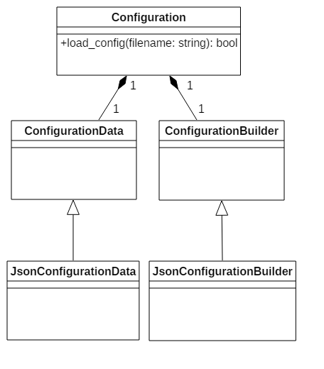
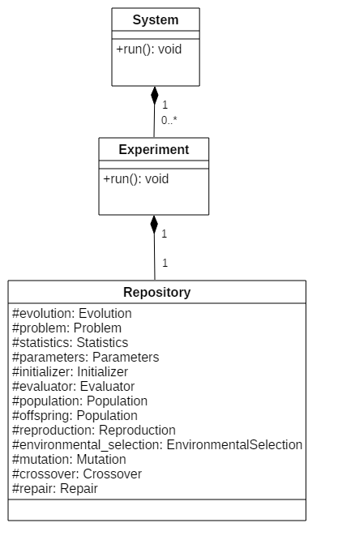
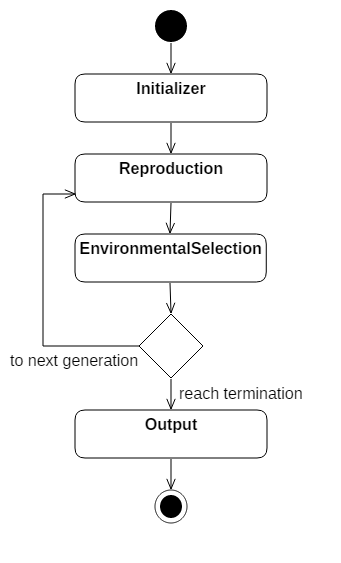
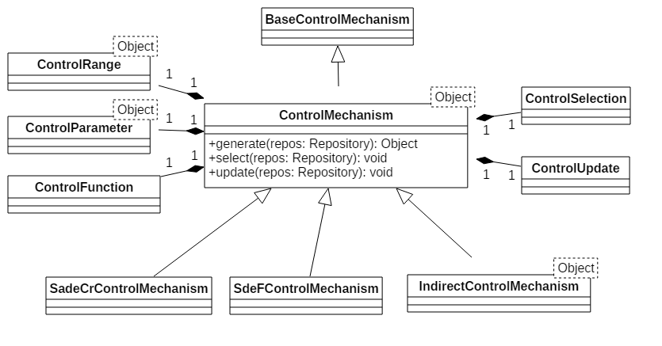
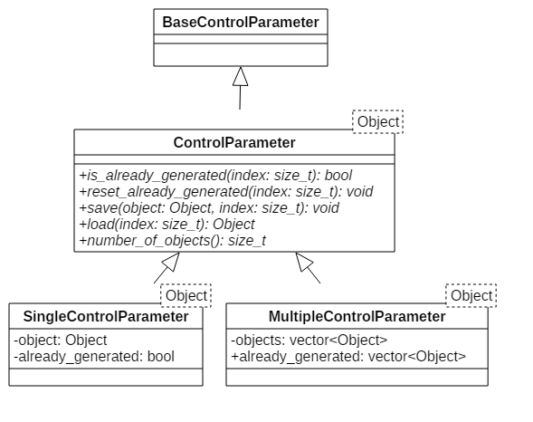
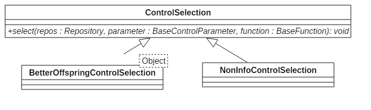
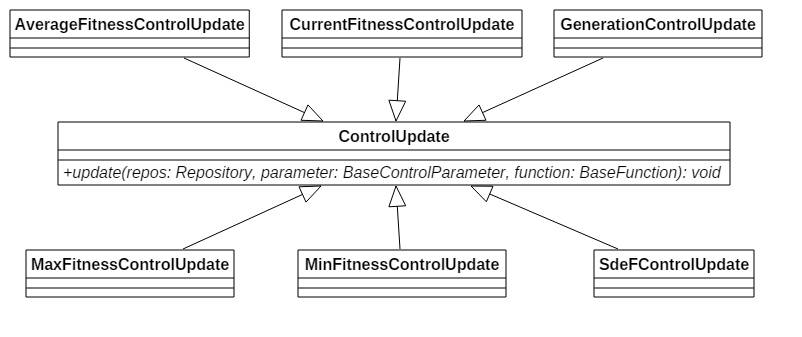
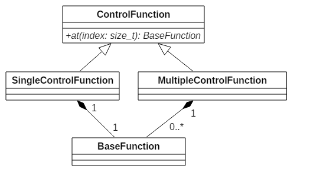

# ADEF Documentation
The documentation consists of many parts, and each part follows section **Description**, **Diagram**, **Usage**, and **Design issue**. Description explains the meaning of entire hierarchy. Diagram illuminates the inheritance relations or workflow. Usage demonstrates how to use its operations and gives examples. Design issue describes what problems meet and the reason to use.

=

Table of contents:
- [Prototype](#prototype)
- [PrototypeManager](#prototypemanager)
- [Configuration](#configuration)
- [System, Experiment, and Repository](#system-experiment-and-repository)
- [EvolutionaryState](#evolutionarystate)
- [Evolutionary flow](#evolutionary-flow)
- [ControlMechanism](#controlmechanism)
    - [ControlRange](#controlrange)
    - [ControlParameter](#controlparameter)
    - [ControlSelection](#controlselection)
    - [ControlUpdate](#controlupdate)
    - [ControlFunction](#controlfunction)
- [Function](#function)

=

## Prototype
http://ukjhsa.github.io/adef/classadef_1_1_prototype.html
##### Description
All classes supported the following feature are derived from `Prototype`:
- change the implementation class by class name on the configuration file.
- configure its internal states on the configuration file.

See also `PrototypeManager`.

##### Diagram
See the API documentation.

##### Usage
If a class `A` derived from `Prototype`, it must implements three functions:

1. `setup(...)` to specify how to configure its internal states.
2. `clone()` and 
3. private function `clone_impl()` to support the virtual copy constructor.

```cpp
class A : public Prototype
{
public:
    std::shared_ptr<A> clone() const
    {
        return std::dynamic_pointer_cast<A>(clone_impl());
    }
    void setup(const Configuration& config, const PrototypeManager& pm) override
    {
        // configure the internal states.
    }
private:
    std::shared_ptr<Prototype> clone_impl() const override
    {
        return std::make_shared<A>(*this);
    }
};
```

Classes which can change the implementation class by class name must be registered to `PrototypeManager`. (see usage of `PrototypeManager`)

##### Design issue
To change the implementation class by class name
- classes must be derived from the common base class.
- ADEF must has the support of Reflection. (see `PrototypeManager`)

Why `setup(...)` accept parameter `PrototypeManager`?
- It is trivial that `Configuration` is used to configure.
- The class name used to change the implementation class is also a part of the configuration data, therefore it exists to configured.

The use of virtual copy constructor
- If we want to copy an individual but we just have its `Prototype` type, we can call `clone()` to do it.

## PrototypeManager
http://ukjhsa.github.io/adef/classadef_1_1_prototype_manager.html
##### Description
`PrototypeManager` implements the simple mechanism of [Reflection](https://en.wikipedia.org/wiki/Reflection_(computer_programming)). It takes the pair of class name as key and class instance as value.

##### Diagram
It contains member data of the map of class name to class instance derived from `Prototype`.

##### Usage
How to register the class `A`?
- `A` have to derive from `Prototype`.
- The use of `register_type(...)` in function `adef::register_type(...)` inside `adef::init_adef(...)`.
    - Suppose the name to register is `A_name` and the instance to register is the call of default constructor. See the documentation of `std::make_shared` if you want to use the custom constructor.

```cpp
pm.register_type("A_name", std::make_shared<A>());
```

How to return the cloned class `A`?
- The use of `make_type(...)` by name, for example, `A_name`.

Some helpful global functions:
- `adef::make_and_setup_type(config, pm)` to get the class name from configuration, then do `make_type(...)` and call `setup(...)` of returning class.
- `adef::make_and_setup_type(name, config, pm)` to get configuration of `name` then do `adef::make_and_setup_type(config, pm)`.

##### Design issue
The mechanism of Reflection
- In order to change the implementation class by class name, there must has a storage that can get the instance by its name.

## Configuration
http://ukjhsa.github.io/adef/classadef_1_1_configuration.html
##### Description
`Configuration` provides interfaces to access the configuration data.

There are three kinds of the configuration data:
- object : consists of members.
    - member: name-value pair. name is `std::string` and value is value accessed by name.
- array : consists of elements.
    - element: value accessed through the ordered index.
- value : can be a null, `true`, `false`, `std::string`, number (including `int`, `unsigned int`, and `double`), object or array.

##### Diagram


It has member data:
- `ConfigurationData`: base class to store the configuration data.
- `ConfigurationBuilder`: base class to create `ConfigurationData`.

If the configuration file is written in [JSON](http://www.json.org/), then it use `JsonConfigurationBuilder` to create `JsonConfigurationData` in function `load_config(...)`.

##### Usage
The format of configuration of each class is listed on the [API documentation](http://ukjhsa.github.io/adef/).

Operations:
- `load_config(...)` to load the configuration data from the file.
- `is_xxxxx()` to check whether the configuration data belongs to `xxxxx`.
- `get_config(name)` and `get_xxxxx_value(name)` are the use of object.
- `get_config(index)`, `get_array_size()`and `get_xxxxx_value(index)` are the use of array.
- `get_xxxxx_value()` and `get_value<xxxxx>()` are the use of value.

##### Design issue
Why the base class `ConfigurationData` and `ConfigurationBuilder` exist, are they just JSON?
- For the extension of XML or other formats in the future. i.e., `XmlConfigurationData` is designed to derive from `ConfigurationData` and created by `XmlConfigurationBuilder`.

The design of interface
- They may not complete for other formats.

## System, Experiment, and Repository
System http://ukjhsa.github.io/adef/classadef_1_1_system.html

Experiment http://ukjhsa.github.io/adef/classadef_1_1_experiment.html

Repository http://ukjhsa.github.io/adef/classadef_1_1_repository.html

##### Description
`System` is the architectural facade of ADEF and it provides a simple interface `System::run()` to use.

Each execution has a variety of experiments, and each experiment contains the number of runs and informations of the algorithm. That is, `System` has many `Experiment`, each `Experiment` has one `Repository`, and `Repository` has total evolutionary states. (see `EvolutionaryState`)

##### Diagram


`System` has member data:
- The name of the current execution.
- `SystemStatistics`: the statistics of total experiments.
- `Experiment`: the experiment.
    - The name of the experiment.
    - The number of runs.
    - `ExperimentalStatistics`: the statistics of total runs.
    - `Repository`: informations of the algorithm.
        - The name of the current algorithm.
        - `Evolution`: the evolutionary flow. (see Evolutionary flow)
        - `Problem`: the problem to be solved.
        - `Statistics`: the statistics of total generations in a run.
        - `Parameters`: the parameters storage.
        - `Initializer`: to initialize population.
        - `Evaluator`: to evaluate the objectives of individuals.
        - `Population`
            - population: the parents of each generation and the population survived to the next generation.
            - offpsring: the offspring of each generation.
        - `Individual`: contains decision variables, objective values, and fitness value.
        - `Reproduction`: The process of reproduction.
        - `EnvironmentalSelection`: The process of environmental selection.
        - `Mutation`: The process of mutation.
        - `Crossover`: The process of crossover.
        - `Repair`: The process of repairing invalid individuals.

##### Usage
Users call `System::run()` to execute and it uses `Experiment::run()` inside to start the evolution according to `Evolution::evolve(...)`.

The statistics
- best, worst, mean, standard deviation, and success performance. See `SystemStatistics`.
- FEs, error, and best fitness on each experiment. See `ExperimentalStatistics`.
- fitness so far, and items on each run. See `Statistics`.

##### Design issue
What is the difference between `System` and `Experiment`?
- The system can have one or many experiments and output statistics of all experiments.

What is the difference between `Experiment` and `Repository`?
- `Experiment` has informations that includes the number of runs and what algorithm, stored in `Repository`, to be used.

Why there need `Repository` to contain informations of the algorithm?
- Because the parameters of function is variable in different evolutionary process, ADEF encapsulates them into the single parameter `Repository` so that we can extract superclass/interface to use. Therefore operations of `Repository` are just getters.

## EvolutionaryState
http://ukjhsa.github.io/adef/classadef_1_1_evolutionary_state.html
##### Description
Classes that participate the evolutionaray process are derived from `EvolutionaryState`.

As above mentioned, these evolutionary states accept `Repository` as a parameter of their function (of superclass at least.)

##### Diagram
See the API documentation.

##### Usage
If a class `A` derived from `EvolutionaryState`, it must implements function:
- `init(...)` to initialize the current state from other states if needed.

```cpp
class A : public EvolutionaryState
{
public:
    void init(std::shared_ptr<Repository> repos) override
    {
        // initialize the internal states from other states if needed.
    }
};
```

##### Design issue
What initialization needs informations from others?
- For example, the initialization of the dimension of decision variables of `Individual` needs the dimension of decision space from `Problem`.

## Evolutionary flow
##### Description
The flow of Evolutionary algorithm implemented by `Evolution::evolve(...)`.

##### Diagram


##### Usage
The use of flow
- Users only need to implement `Reproduction` or `EnvironmentalSelection` or their derived classes if the flow satisfied.
- The order of `Mutation`, `Crossover` and `Repair` in `Reproduction` are flexible
    - in DE, their order is `Mutation`, `Crossover` then `Repair`. See `DEReproduction`.
    - in GA, their order is maybe `Crossover`, `Mutation` then `Repair`.
- `Statistics` is used after the following position:
    - `Initializer`: statistics of the initial population.
    - `Reproduction`: statistics of the population of parents and offsprings on each generation.
    - `EnvironmentalSelection`: statistics of the current population on each generation.

##### Design issue
Why the choice of implementing different `Reproduction` and `EnvironmentalSelection` instead of implementing different `Evolution` on the flow?
- Implementing different `Evolution` is an alternative, but here ADEF want users write each operators likes mutation or crossover to focus on the feature of changing implementation classes dynamically. Overriding the flow only when it is necessary, and `Reproduction` too.

## ControlMechanism
http://ukjhsa.github.io/adef/classadef_1_1_base_control_mechanism.html
##### Description
`ControlMechanism` represents the mechanism of adjusting the object.

In order to adjust the object, the following subjects are concerned:
- The type
- The range
- The location and amount
- The information source
- The timing to adjust
- The way to adjust

In DE, *F* and *CR* are objects and subjects represent
- they are `double`.
- they have the lower bound and upper bound to check whether they are valid.
- they are dependent or independent to each individual, and they are the same or different.
- they are adjusted by no additional information, the relation between parent and offspring, or the feature of current population.
- they are adjusted on mutation, crossover, or environmental selection.
- they are constant, changeable, generated by distribution or specific formula.

Therefore there are classes to support each subject
- Object type according to the template type
- `ControlRange` manages the range.
- `ControlParameter` manages objects, and `ControlFunction` manages `Function`.
- `ControlSelection` use the relation between parent and offspring and `ControlUpdate` use the feature of current population.
- The call of `ControlMechanism::generate(...)`, `ControlMechanism::select(...)`, and `ControlMechanism::update(...)`.
- `Function` specifies the formula.

See following subsection for the details to adjust the object.

##### Diagram


`ControlMechanism` is derived from `BaseControlMechanism`, the base abstract class, and has subclasses:
- `SadeCrControlMechanism`: used by parameter CR in the SaDE algorithm.
- `SdeFControlMechanism`: used by parameter F in the SDE algorithm.
- `IndirectControlMechanism`: used by parameter F in the both NSDE and SaNSDE algorithm.

##### Usage
If there is a parameter which is declared by `ControlMechanism`, the suggested usage are:

1. call `update(...)` firstly.
2. call `generate(...)` when you want to get the new parameter.

And call `select(...)` after `Reproduction` or inside `EnvironmentalSelection`.

```cpp
void DECrossover::crossover(std::shared_ptr<Repository> repos) const
{
    // cr is ControlMechanism<double> type
    auto cr = std::dynamic_pointer_cast<ControlMechanism<double>>(cr_);

    for each individual in population {

        // update firstly
        cr->update(repos);
        // then generate the new CR value
        auto crossover_rate = cr->generate(repos);

        do crossover.
        
        // it can NOT call cr->select(repos) because offspring is incomplete
        // see DEEnvironmentalSelection::select(repos)
    }
}
```

The parameter *F* and *CR* in DE:
- The parameter *F* is the member data of `DEMutation` and *CR* is the member data of `DECrossover`.
- Both parameters are declared by `BaseControlMechanism`.
- They should be stored to `Parameters` to let `DEEnvironmentalSelection` have the ability to use them.

```cpp
class DECrossover : public Crossover
{
    // skip other attributes and operations
private:
    std::shared_ptr<BaseControlMechanism> cr_;
};

void DECrossover::init(std::shared_ptr<Repository> repos)
{
    repos->parameters()->store("cr", cr_);
}
```

##### Design issue
Why the use of calling `select(...)` inside `EnvironmentalSelection`?
- `select(...)` uses the relation between parent and offspring so it must be called after `Reproduction` which reproduces complete offspring.

Why parameters *F* and *CR* are declared by `BaseControlMechanism`?
- They are not necessary to expose the template type of `ControlMechanism` to other evolutionary states, so `DEEnvironmentalSelection` does.
- `dynamic_cast` to actual type only on the use of `generate(...)`,i.e., in `DEMutation` and `DECrossover`.

By issues above, why parameters *F* and *CR* are the member data of `DEMutation` and `DECrossover`?
- This issue has no absolute solution. ADEF takes the reason they just come from mutation and crossover.

What is the difference between `ControlMechanism` and its subclasses?
- `SadeCrControlMechanism`: the function to record inside function "mean".
- `SdeFControlMechanism`: if the new object is invalid, then truncate the constant part.
- `IndirectControlMechanism`:
    - it has a data member declared by `ControlMechanism`.
    - it has no own `ControlFunction`, the function is obtained from the data member instead.
    - `select(...)` and `update(...)` call the corresponding interface of the data member.

### ControlRange
http://ukjhsa.github.io/adef/classadef_1_1_control_range.html
##### Description
`ControlRange` manages the range, including the lower bound and upper bound, of the object.

It has two template versions

1. arithmetic type.
    - it has the range of the object.
2. non-arithmetic type.
    - it has no defenition of the range.
    - see http://ukjhsa.github.io/adef/classadef_1_1_control_range_3_01_t_00_01std_1_1enable__if__t_3_9std_1_1is__arithmetic_3_01_t_01_4_1_1value_01_4_01_4.html

##### Diagram
See the API documentation.

##### Usage
`is_valid(...)` to check whether the object is in the range. If the Object type is not arithmetic, it always return `true`.

It is used in `ControlMechanism::generate(...)`

```cpp
generate the newer object
while (! is_valid(object)) {
    re-generate object
}
return object
```

##### Design issue
The template specialization for non-arithmetic type
- In current version, the type is concerned with `std::shared_ptr<RealFunction>` and it has no concept of range.

### ControlParameter
http://ukjhsa.github.io/adef/classadef_1_1_control_parameter.html
##### Description
`ControlParameter` is the storage of new objects generated by `Function::generate(...)`.

According to the ownership of objects on each individual, it has two implementation classes
- All individuals use the unique object, that is, the object is dependent to the use of other individuals.
    - use `SingleControlParameter`.
- All individuals has its own object, that is, objects are independent to each individual.
    - use `MultipleControlParameter`.

Note that the ownership of objects does **NOT** imply the information source. Individuals have its own object, but it is possible to collect objects from all individuals to adjust.

See `Function` for the details to generate the object.

##### Diagram


It also has superclass `BaseControlParameter`.

##### Usage
Operations
- `save(object, index)` to store the object.
- `load(index)` to load the object.
- `number_of_objects()` to return the number of objects.

The following operations manages the flag of already generated:
- `is_already_generated(index)` to return the flag.
- `reset_already_generated(index)` to reset the flag.

The parameter `index` is ignored by `SingleControlParameter` because it has only one object.

They are used in `ControlMechanism::generate(...)`

```cpp
if (is_already_generated(index))
{
    return object loaded from ControlParameter
}
else {
    generate the newer object
    save object to ControlParameter
    return object
}
```

##### Design issue
What the use does `BaseControlParameter` have?
- It is not necessary to expose the template type of `ControlParameter` to others. For examples, `MaxFitnessControlUpdate` does not load object from it, but `SdeFControlUpdate` does.

Why the parameter `index` exist in its operations?
- There is one `ControlMechanism` used by many individuals, so it have to separate which individual uses from population.

Why `is_already_generated(index)` and `reset_already_generated(index)` exist?
- To returning the same result last time if it doesn't reset.
- `IndirectControlMechanism` must need this feature.

### ControlSelection
http://ukjhsa.github.io/adef/classadef_1_1_control_selection.html
##### Description
`ControlSelection` use the relation between parent and offspring to adjust the object.

It has many way to use the relation between parent and offspring:
- don't use it
    - use `NonInfoControlSelection`
- check whether offspring is better than parent
    - use `BetterOffspringControlSelection`

See `Function` for the details to adjust the object.

##### Diagram


##### Usage
`select(repos, base_parameter, base_function)` to use the relation between parent and offspring.

It is used in `ControlMechanism::select(...)`

```cpp
void select(std::shared_ptr<Repository> repos)
{
    call ControlSelection::select(...);
}
```

##### Design issue
Why `select(repos, base_parameter, base_function)` accept these parameters?
- `Repository` is to pass information including parent, offspring, target_index, etc.
- `BaseControlParameter` is to adjust the object by loading object from `ControlParameter`.
- `BaseFunction` is to adjust the object. See `Function` for the details.

### ControlUpdate
http://ukjhsa.github.io/adef/classadef_1_1_control_update.html
##### Description
`ControlUpdate` use the feature of current population to adjust the object.

It has many way to use the feature of current population:
- the average fitness
    - use `AverageFitnessControlUpdate`
- the fitness of current individual
    - use `CurrentFitnessControlUpdate`
- the maximum fitness
    - use `MaxFitnessControlUpdate`
- the minimum fitness
    - use `MinFitnessControlUpdate`
- the current number of generation
    - use `CurrentFitnessControlUpdate`
- the procedure of F value in the SDE algorithm
    - use `SdeFControlUpdate`

See `Function` for the details to adjust the object.

##### Diagram


##### Usage
`update(repos, base_parameter, base_function)` to use the feature of current population.

It is used in `ControlMechanism::update(...)`

```cpp
void update(std::shared_ptr<Repository> repos)
{
    for each ControlUpdate {
        call ControlUpdate::update(...);
    }
}
```

##### Design issue
Why `update(repos, base_parameter, base_function)` accept these parameters?
- `Repository` is to pass information including target_index, some fitness of population, population size, generation, etc.
- `BaseControlParameter` is to adjust the object by loading object from `ControlParameter`.
- `BaseFunction` is to adjust the object. See `Function` for the details.

### ControlFunction
http://ukjhsa.github.io/adef/classadef_1_1_control_function.html
##### Description
`ControlFunction` is the storage of `Function` that adjusts the object.

According to the adjustment of the object, it has the following usage
- the adjustment doesn't need additional informations.
    - use `SingleControlFunction`.
- the adjustment needs informations that is dependent to other individuals.
    - use `SingleControlFunction`.
- the adjustment needs informations that is independent to each individual.
    - use `MultipleControlFunction`.

##### Diagram


The subclasses manages one or many `BaseFunction`.

##### Usage
Operations
- `at(index)` to return the function.

The parameter `index` is ignored by `SingleControlFunction` because it has only one function.

They are used in `ControlMechanism::generate(...)`

```cpp
function = ControlFunction::at(index)
object = generate the newer object from function
save object to ControlParameter
return object
```

##### Design issue
Why the parameter `index` exist in its operations?
- There is one `ControlMechanism` used by many individuals, so it have to separate which individual uses from population.

## Function
http://ukjhsa.github.io/adef/classadef_1_1_base_function.html
##### Description
`Function` represents the method to adjust the object.

The adjustment can be seen as the formula with many inputs and one output. Implementations of `ControlSelection` and `ControlUpdate` are the process of passing inputs into the formula, and its calculation result is the output, the adjusted object.

The output is obtained by calling `generate()`. The formula generates the calculation result according to its internal states, and states is updated by calling `update()`. The call of `record(...)` is to pass inputs into it. For example, suppose there is a Normal distribution with mean and standard deviation:

1. use `record(...)` to pass the newer value of mean and/or standard deviation into the formula.
2. use `update()` to update the value of mean and standard deviation used by the distribution.
3. use `generate()` to generate random number according to the Normal distribution.

Note that `record(...)` does **NOT** change values used by the distribution, `update()` does. The reason is described below.

`Function` implements the [Composite pattern](https://en.wikipedia.org/wiki/Composite_pattern) so that the input is also `Function`.

For example, there is also the Normal distribution with mean and standard deviation. The value of the mean may be a constant value or a dynamic value generated by the uniform distribution, so the mean can be seen as the output of the formula which returns a fixed value or a random value from the uniform distribution.

Let's give the same example to explain more details: there is the Normal distribution `NormalDis` with mean `mean` and standard deviation `stddev`. Both `mean` and `stddev` are the `Function`.

1. use `record(...)` to pass the newer value of mean into `mean` and/or newer standard deviation into `stddev`.
2. use `update()` to update the value of mean generated by `mean` and standard deviation generated by `stddev`.
3. use `generate()` to generate random number by `NormalDis` with updated mean and standard deviation.

The value of mean generated by `mean` is based on what formula the `mean` is, and `NormalDis` use it as `NormalDis`'s mean.

You can see that `Function` has tree structures caused by the Composite pattern. The Composite and Leaf Component listed below:
- Composite
    - `CauchyDisFunction`
    - `NormalDisFunction`
    - `UniformDisFunction`
    - `LearningPeriodFunction`
    - `DepdFFunction`
    - `IsadeCrFunction`
    - `IsadeFFunction`
    - `JdeCrFunction`
    - `JdeFFunction`
- Leaf Component
    - `ConstantFunction`
    - `VariableFunction`
    - `GatherInfoFunction`
        - `MedianFunction`
    - `RandomSelectionFunction`
    - `ScoredFunction`
        - `RouletteWheelSelectionFunction`
        - `WeightedAverageFunction`
    - `SdeFFunction` (it has some different)

##### Diagram
See the API documentation.

Although `Function` has the ability to support Composite, Leaf Component is derived from it for the convenience. (see Design issue)

##### Usage

##### Design issue
